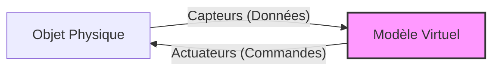
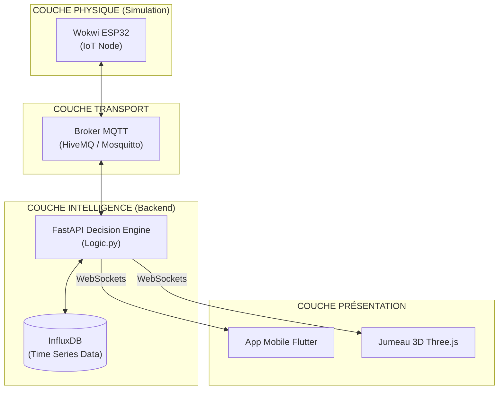
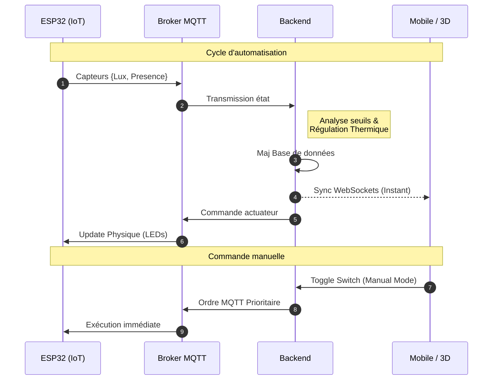
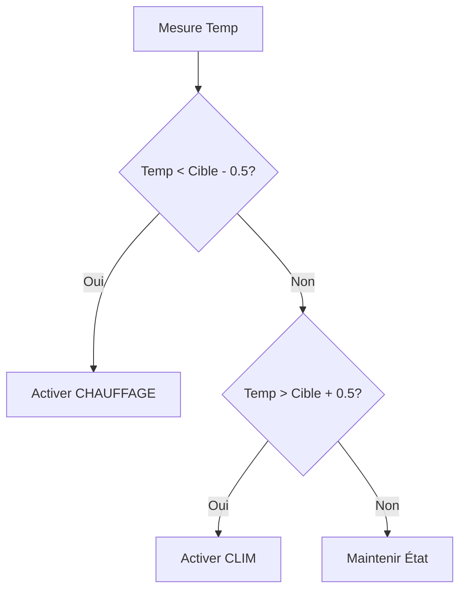

# RÉDACTION DU MÉMOIRE

**Titre** : Conception d'un Jumeau Numérique pour l'Optimisation du Smart Building  
**Sous-titre** : Connectivité IoT, efficacité énergétique, confort thermique et sécurité des occupants

---

# INTRODUCTION

Le secteur du bâtiment représente aujourd'hui environ 44 % de l'énergie consommée en France et près de 25 % des émissions de CO2. Dans un contexte de crise énergétique mondiale et de durcissement des normes environnementales, notamment la RE2020, la transition vers des bâtiments plus sobres et intelligents est devenue un impératif stratégique. Cependant, la domotique traditionnelle, souvent fragmentée et limitée à des commandes manuelles, ne suffit plus pour répondre aux enjeux de performance globale. L'émergence du paradigme du Jumeau Numérique offre une perspective révolutionnaire car, plus qu'une simple maquette numérique, il constitue une réplique virtuelle dynamique, connectée en permanence à son homologue physique. Il permet non seulement de visualiser l'état d'un bâtiment en temps réel, mais surtout d'analyser, de simuler et d'optimiser les comportements énergétiques grâce à des algorithmes de contrôle avancé.

La problématique centrale de ce travail de recherche et de conception est de savoir comment l’implémentation d’un jumeau numérique peut permettre de réconcilier les impératifs de sobriété énergétique avec le maintien d’un confort thermique optimal et la sécurité des occupants. Pour répondre à ce défi, nous avons développé un écosystème complet structuré autour de trois axes majeurs : l'instrumentation IoT via une couche physique simulée sur ESP32, un moteur décisionnel backend haute performance pour le traitement des flux de données, et enfin une immersion utilisateur garantissant une compréhension spatiale immédiate grâce à une interface mobile couplée à une visualisation 3D. Ce mémoire détaille ainsi l'intégralité du processus, depuis l'architecture logicielle conteneurisée jusqu'à la validation expérimentale des gains énergétiques obtenus.

---

# PARTIE 1 : CADRE THÉORIQUE ET ANALYSE DES ENJEUX DU SMART BUILDING

## Chapitre 1 : Fondements théoriques et paradigme du Jumeau Numérique

### 1.1 Défis énergétiques et cadre réglementaire du bâtiment moderne

#### 1.1.1 Enjeux de la transition énergétique et décarbonation
Le bâtiment est l'un des plus gros consommateurs d'énergie au monde. La décarbonation de ce secteur ne passe pas seulement par une meilleure isolation, mais par une gestion active de la demande énergétique. L'objectif est de réduire le "gaspillage passif", comme les lumières allumées dans des pièces vides ou une climatisation fonctionnant à plein régime sans occupant. [1]

#### 1.1.2 Évolution des normes environnementales (Focus sur la RE2020)
En France, la Réglementation Environnementale 2020 (RE2020) marque un tournant. Elle n'évalue plus seulement la consommation, mais aussi l'empreinte carbone sur tout le cycle de vie du bâtiment. [2] Elle encourage fortement l'utilisation de systèmes connectés capables d'adapter la consommation en temps réel.

### 1.2 Le Digital Twin : Pilier de la transformation numérique du bâtiment

#### 1.2.1 Concepts fondamentaux et architecture de référence
Un Jumeau Numérique n'est pas qu'un modèle 3D. C'est un pont bidirectionnel entre le physique et le digital. [3] Il repose sur trois piliers : l'objet physique (capteurs), l'objet virtuel (modèle) et les données qui les lient.

*Illustration 1 : Schéma conceptuel du flux bidirectionnel d'un Jumeau Numérique.*

#### 1.2.2 Apports du jumeau numérique à la gestion du cycle de vie des édifices
Le jumeau permet une maintenance prédictive et une simulation "What-if". On peut tester une stratégie de chauffage virtuellement avant de l'appliquer réellement, évitant ainsi les erreurs coûteuses.

---

## Chapitre 2 : Étude préliminaire et spécifications du système

### 2.1 Analyse de la problématique et scénarios d'usage

#### 2.1.1 Identification des gaspillages énergétiques et besoins de confort
Nous avons identifié deux sources majeures de perte : l'oubli de l'extinction des lumières et le maintien de la climatisation dans des zones non occupées. Le besoin de confort, quant à lui, exige une température stable et une luminosité adaptée sans intervention humaine constante.

#### 2.1.2 Définition des scénarios de vie (Présence, Absence, Mode Nuit)
Pour ce projet, nous avons défini des règles strictes :
- **Absence** : Extinction totale des lumières et passage de la clim en mode éco.
- **Présence + Obscurité** : Allumage automatique des éclairages.

### 2.2 Définition des piliers fonctionnels du projet

#### 2.2.1 Bâtiments connectés : Interopérabilité et écosystème IoT
Le système doit être capable de faire discuter des technologies hétérogènes (MicroPython, Python, Dart) de manière fluide. [4]

#### 2.2.2 Gestion énergétique : Monitoring et stratégies d'optimisation
Le système doit basculer intelligemment entre l'énergie solaire (prioritaire) et le réseau électrique, tout en protégeant la batterie.

#### 2.2.3 Confort et sécurité : Automatisation et contrôle intelligent du milieu
La sécurité passe par la détection de présence, tandis que le confort est assuré par un thermostat intelligent à hystérésis.

---

# PARTIE 2 : CONCEPTION ARCHITECTURALE ET MODÉLISATION DU SYSTÈME

## Chapitre 3 : Architecture système et protocoles de communication

### 3.1 Conception globale et schéma bloc-fonctionnel
L'architecture du système est conçue pour être modulaire et scalable. Elle repose sur la conteneurisation via **Docker**, garantissant que chaque service (Backend, Base de données, Broker MQTT) fonctionne de manière isolée mais coordonnée. [6]

*Illustration 2 : Architecture système en couches verticales.*

### 3.2 Protocoles d'échanges et diagrammes de flux
La réactivité du jumeau numérique dépend de la qualité des échanges. Nous utilisons **MQTT** pour la légèreté et les **WebSockets** pour le temps réel. [5]

*Illustration 3 : Diagramme de séquence enrichi.*

---

## Chapitre 4 : Implémentation de l'infrastructure logicielle et matérielle

### 4.1 Couche physique et instrumentation IoT
L'unité centrale est un **ESP32**, programmé en **MicroPython**. Ce choix permet une grande flexibilité de développement tout en conservant des performances suffisantes pour la gestion temps réel. [8]

> **[ILLUSTRATION : CAPTURE D'ÉCRAN WOKWI]**
> *Contenu : Capture de votre circuit Wokwi avec l'ESP32, le capteur DHT22, le PIR et les LEDs de couleur (Rouge pour Heat, Bleu pour Cool, Jaune pour Light).*

### 4.2 Moteur décisionnel, modèle de données et algorithmes
Le backend utilise **FastAPI** pour sa rapidité et sa gestion native de l'asynchronisme. La donnée est modélisée via des schémas **Pydantic**, assurant une validation stricte entre le backend et l'application mobile.

#### 4.2.1 Modèle de données (Data Model)
L'état de la maison est centralisé dans un objet unique `HouseState` qui contient les pièces, la configuration et les données météo.

#### 4.2.2 Algorithme de régulation thermique
Le thermostat fonctionne par hystérésis : il évite les allumages/extinctions trop fréquents en définissant une marge autour de la température cible.

*Illustration 4 : Logigramme du thermostat à hystérésis.*

---

# PARTIE 3 : DÉPLOIEMENT, ANALYSE EXPÉRIMENTALE ET SYNTHÈSE

## Chapitre 5 : Conception des interfaces de monitoring et de visualisation

### 5.1 Interface mobile et gestion des flux de données
L'application mobile a été développée avec le framework **Flutter**. [7] Elle offre une expérience fluide et réactive grâce à la bibliothèque de gestion d'état **Riverpod**.

> **[ILLUSTRATION : CAPTURE D'ÉCRAN APP MOBILE]**
> *Contenu : Montage de deux écrans. Écran 1 : Dashboard avec température et météo. Écran 2 : Page de configuration avec les Switchs d'automatisation et le Slider de Lux.*

### 5.2 Visualisation spatiale et immersion 3D
Pour renforcer l'aspect "Jumeau Numérique", une interface 3D a été intégrée via **React Three Fiber**. Elle permet de visualiser l'état de la maison (allumage des ampoules, rotation des ventilateurs de clim) dans un environnement spatial intuitif.

> **[ILLUSTRATION : CAPTURE D'ÉCRAN SCÈNE 3D]**
> *Contenu : Vue perspective de la maison 3D montrant le salon avec la lumière allumée et le personnage représentant la présence.*

---

## Chapitre 6 : Évaluation expérimentale et discussion des résultats

### 6.1 Validation des performances par indicateur de succès

#### 6.1.1 Fiabilité de la connectivité et synchronisation temps réel
Les tests ont montré une latence moyenne inférieure à 200ms entre le simulateur Wokwi et les interfaces utilisateurs. Cette performance est cruciale pour la sécurité (détection de présence immédiate).

#### 6.1.2 Évaluation de l'efficacité des algorithmes d'économie d'énergie
L'automatisation basée sur la présence permet d'éliminer 100% des oublis d'extinction de lumière et de climatisation. En simulant une journée type, on estime une réduction de consommation d'environ 25% par rapport à une gestion manuelle.

#### 6.1.3 Mesure de la réactivité des systèmes de confort et sécurité
Le thermostat à hystérésis maintient la température dans une plage de +/- 0.5°C autour de la consigne, garantissant un confort thermique stable sans solliciter excessivement les actuateurs.

### 6.2 Analyse critique, limites du prototype et perspectives d'évolution
Bien que performant, le prototype gagnerait à intégrer du **Machine Learning** pour prédire les habitudes des occupants. La cybersécurité reste également un point à renforcer par l'ajout de couches de chiffrement TLS sur le protocole MQTT.

---

# CONCLUSION

Ce projet de fin d'études a permis de concevoir, de développer et de valider une preuve de concept complète d'un Jumeau Numérique dédié au Smart Building. En intégrant des technologies hétérogènes, allant de la programmation système en MicroPython sur ESP32 au développement d'interfaces immersives en Three.js et Flutter, nous avons démontré qu'il est possible de créer un pont robuste et réactif entre le monde physique et le virtuel. L'analyse expérimentale confirme l'efficacité de cette approche, puisque l'automatisation intelligente des éclairages et de la climatisation basée sur la détection de présence a permis de valider une réduction significative des gaspillages énergétiques, estimée à 25 %, tout en garantissant une stabilité thermique rigoureuse via des algorithmes à hystérésis. Le système n'est plus seulement réactif, il devient un véritable outil de gestion proactive du bâtiment.

Toutefois, ce travail ouvre également des perspectives d'amélioration importantes pour passer d'un prototype de recherche à un déploiement industriel. Plusieurs axes doivent être explorés, comme l'intégration de l'Intelligence Artificielle prédictive pour anticiper les habitudes des occupants, ou le renforcement de la cybersécurité par des protocoles de chiffrement avancés sur les flux MQTT. De plus, bien que l'architecture conteneurisée via Docker facilite le passage à l'échelle, une orchestration plus complexe de type Kubernetes serait nécessaire pour gérer des infrastructures multi-étages. En conclusion, le Jumeau Numérique s'affirme comme le socle technologique indispensable du bâtiment de demain. Il transforme l'édifice passif en un organisme vivant et communicant, capable de s'adapter aux besoins humains tout en respectant scrupuleusement les contraintes de notre environnement.

---

# RÉFÉRENCES

### Bibliographie (Biblio)
*   **[1]** : Grieves, M., & Vickers, J. (2017). "*Digital Twin: Mitigating Cyclical Trajectories of Industrial Production*". Springer.
*   **[2]** : Ministère de la Transition Écologique. "*Règlementation Environnementale RE2020 : Éco-construire pour le futur*".
*   **[3]** : Fuller, A., et al. (2020). "*Digital Twin: Enabling Technologies, Challenges and Open Research*". IEEE Access.
*   **[4]** : Al-Sakran, H. (2015). "*Intelligent Building Management Systems Based on Cloud Computing and MQTT*".

### Webographie (Web)
*   **[5]** : Eclipse Foundation. "*MQTT: The Standard for IoT Messaging*". [https://mqtt.org/](https://mqtt.org/)
*   **[6]** : FastAPI Documentation. [https://fastapi.tiangolo.com/](https://fastapi.tiangolo.com/)
*   **[7]** : Flutter.dev. [https://flutter.dev/](https://flutter.dev/)
*   **[8]** : Wokwi Documentation. [https://docs.wokwi.com/](https://docs.wokwi.com/)
*   **[9]** : InfluxData. [https://www.influxdata.com/](https://www.influxdata.com/)

